# Travel Tracker Mobile

## Collaborative trip planner with automatic background sync and seamless cross-platform UX.

[](https://reactnative.dev/)
[](https://expo.dev/)
[](https://www.typescriptlang.org/)
[](https://supabase.com/)
[](https://tanstack.com/query/latest)

## Key Features

- **Smart Itinerary Builder** – Drag-and-drop activities, automatic route sorting, address geocoding
- **Offline Support** – Optimistic UI, mutation queue, automatic background sync on reconnect
- **Real-Time Collaboration** – Live updates for activities, comments, and member roles via Supabase Channels
- **Role-Based Access** – `Owner` / `Editor` / `Viewer` permissions with secure RLS policies
- **System Theme Sync** – Automatic light/dark adaptation with persistent user preference
- **Deep Linking Invites** – One-tap trip joining via secure UUID-based invite links

## 🛠 Tech Stack

| Category         | Technologies                                                              |
| ---------------- | ------------------------------------------------------------------------- |
| **Frontend**     | React Native, Expo SDK 54, TypeScript, Expo Router, FlashList, Reanimated |
| **State & Data** | TanStack Query v5, Zustand, `@tanstack/query-async-storage-persister`     |
| **Backend**      | Supabase (PostgreSQL, RLS, Realtime, Auth, Edge Functions)                |
| **Native APIs**  | NetInfo, Expo Location, Deep Linking, Clipboard, System UI                |
| **Tooling**      | ESLint, Prettier, Metro                                                   |

## 🏗 Architecture & Engineering Decisions

### Offline-First Data Layer

- Built a **custom mutation queue** (`offlineQueue.ts`) that intercepts failed requests, stores them in AsyncStorage, and replays them on network restore.
- Wrapped React Query mutations in `useOfflineMutation<T>` for **type-safe optimistic updates** with automatic rollback on failure.
- Used `createAsyncStoragePersister` to cache query results across app restarts, ensuring instant UI hydration.

### Real-Time Conflict Resolution

- Solved React Strict Mode + Supabase channel caching conflicts by generating **unique channel names** per mount and explicitly calling `supabase.removeChannel()` in cleanup.
- Implemented **debounced invalidation** to prevent query spam during rapid drag-and-drop operations.

### Security & Type Safety

- Strict RLS policies on all tables (`activities`, `expenses`, `trip_members`, `comments`) scoped to `auth.uid()` and `trip_id`.
- End-to-end TypeScript with **Zod runtime validation** for API payloads and form inputs.
- Supabase client generated with `supabase gen types typescript` for zero-drift schema sync.

## Screenshots

<table>
  <tr>
    <td align="center">
      <br/>
      <sub>Login (light)</sub>
    </td>
    <td align="center">
      <br/>
      <sub>Register (light)</sub>
    </td>
    <td align="center">
      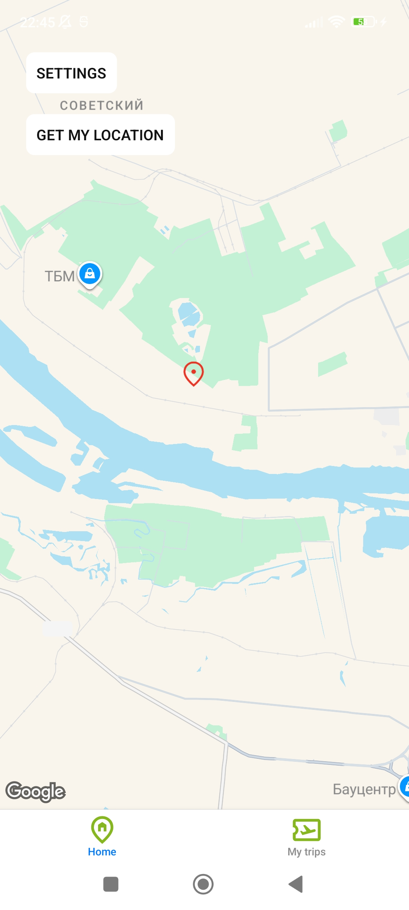<br/>
      <sub>Home (light)</sub>
    </td>
  </tr>
  <tr>
    <td align="center">
      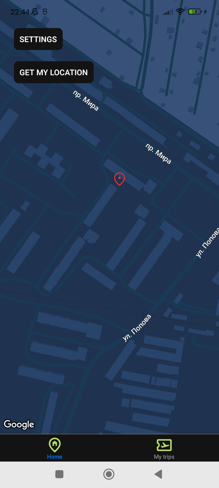<br/>
      <sub>Home (dark)</sub>
    </td>
    <td align="center">
      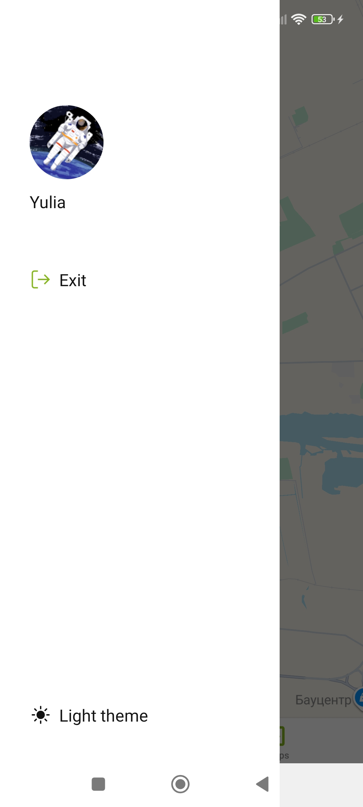<br/>
      <sub>Menu (light)</sub>
    </td>
    <td align="center">
      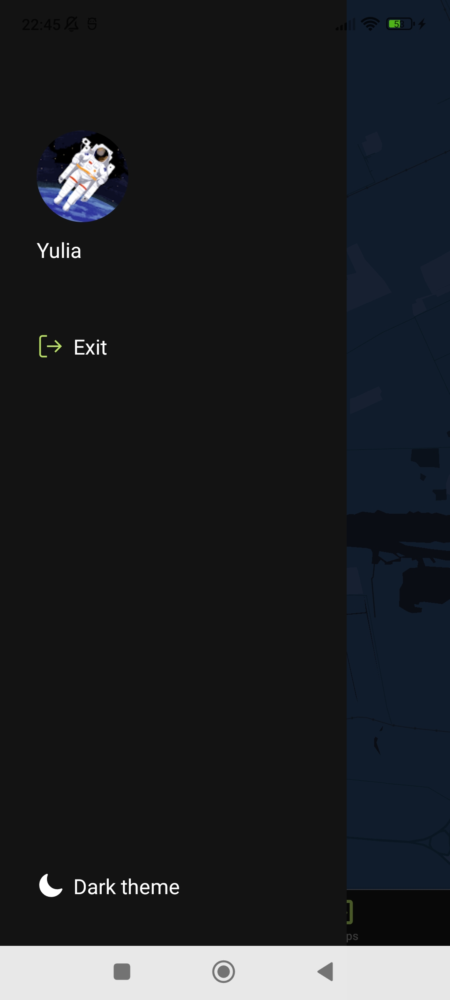<br/>
      <sub>Menu (dark)</sub>
    </td>
  </tr>
  <tr>
    <td align="center">
      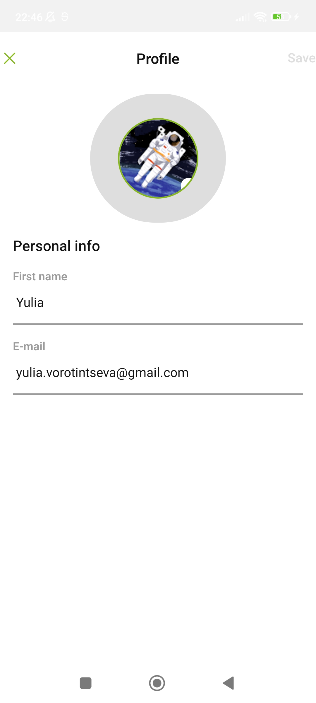<br/>
      <sub>Profile</sub>
    </td>
    <td align="center">
      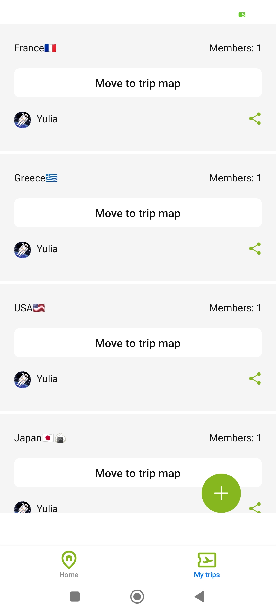<br/>
      <sub>Trips (light)</sub>
    </td>
    <td align="center">
      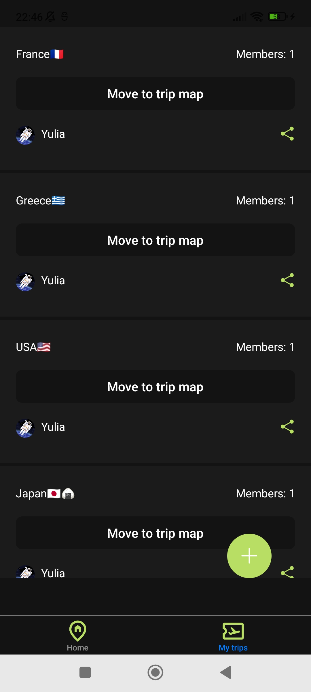<br/>
      <sub>Trips (dark)</sub>
    </td>
  </tr>
  <tr>
    <td align="center">
      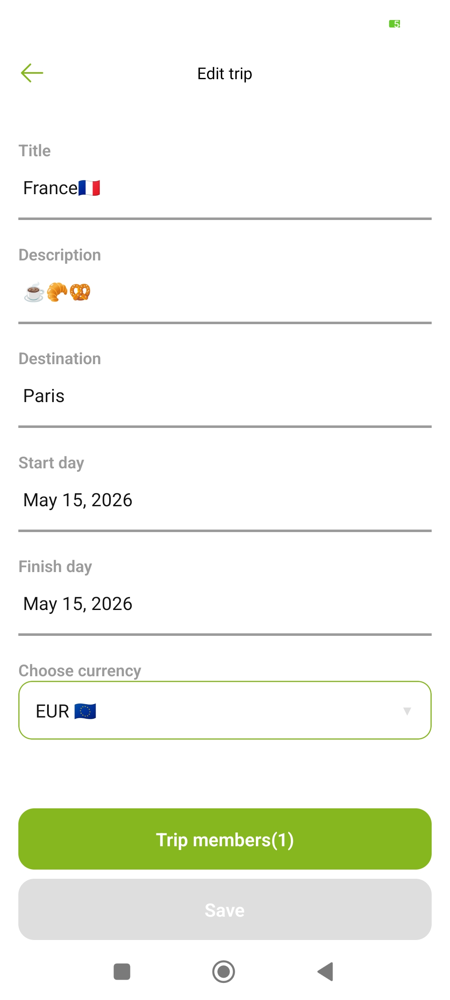<br/>
      <sub>Edit trip</sub>
    </td>
    <td align="center">
      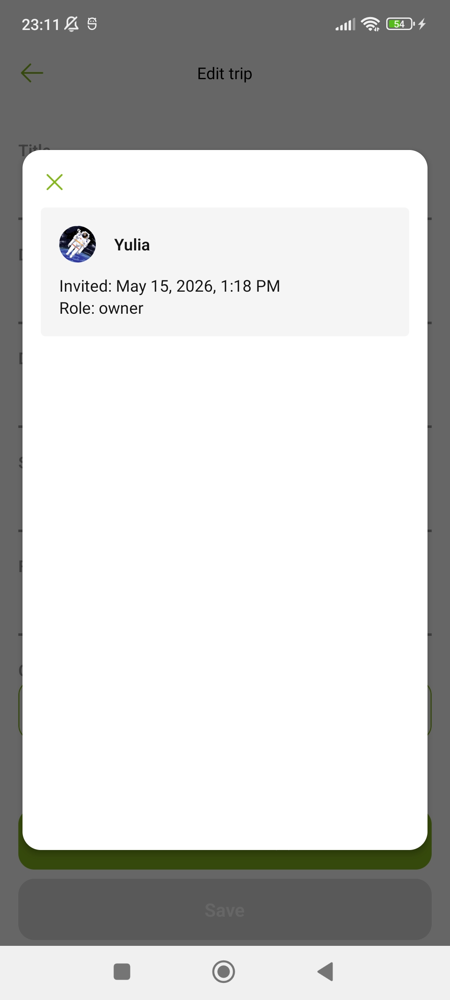<br/>
      <sub>Members</sub>
    </td>
    <td align="center">
      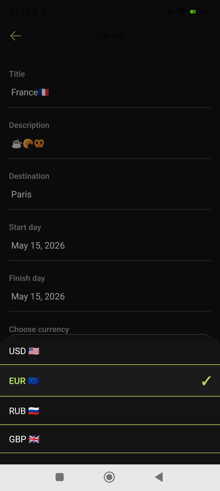<br/>
      <sub>Currency (dark)</sub>
    </td>
  </tr>
  <tr>
    <td align="center">
      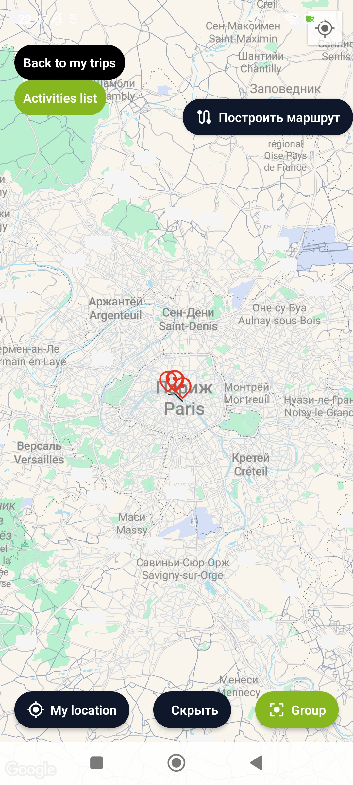<br/>
      <sub>Map (no group)</sub>
    </td>
    <td align="center">
      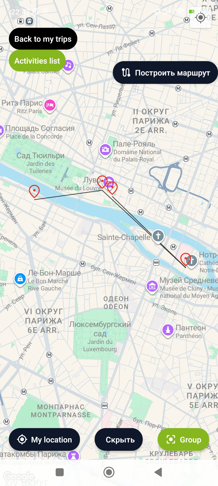<br/>
      <sub>Map (with group)</sub>
    </td>
    <td align="center">
      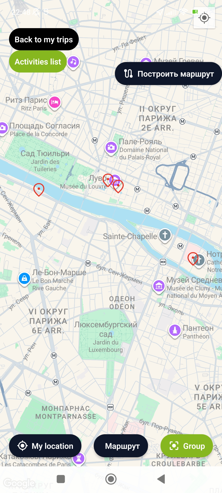<br/>
      <sub>Map (no route)</sub>
    </td>
  </tr>
  <tr>
    <td align="center">
      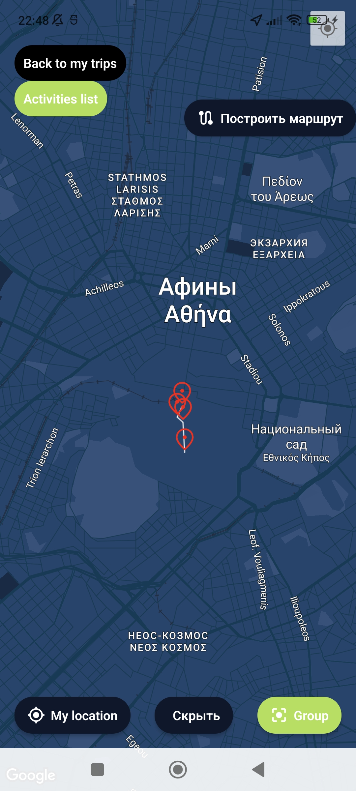<br/>
      <sub>Map (dark)</sub>
    </td>
    <td align="center">
      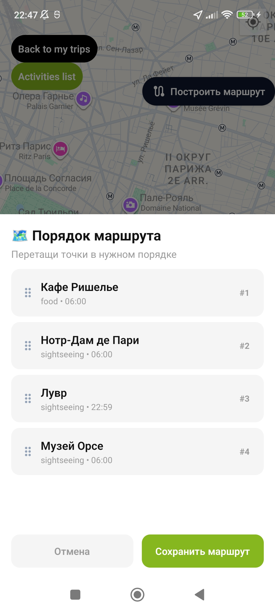<br/>
      <sub>Route builder (light)</sub>
    </td>
    <td align="center">
      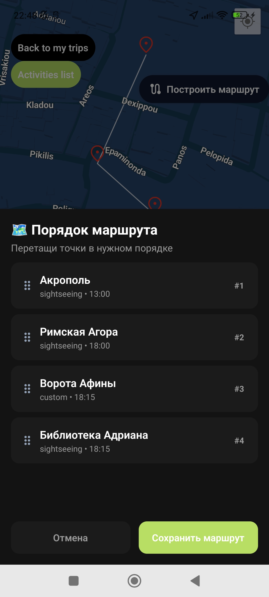<br/>
      <sub>Route builder (dark)</sub>
    </td>
  </tr>
  <tr>
    <td align="center" colspan="2">
      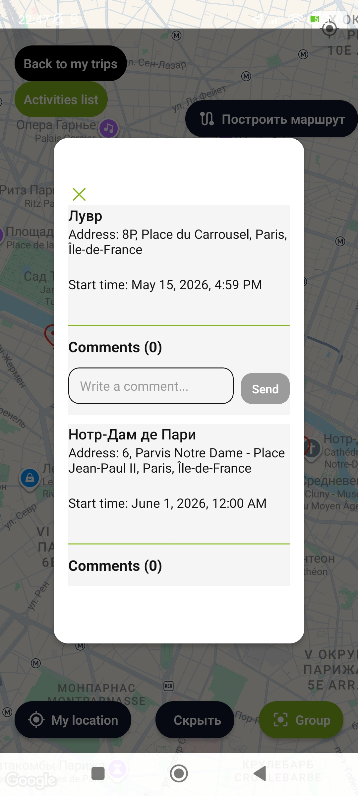<br/>
      <sub>Activities (light)</sub>
    </td>
    <td align="center">
      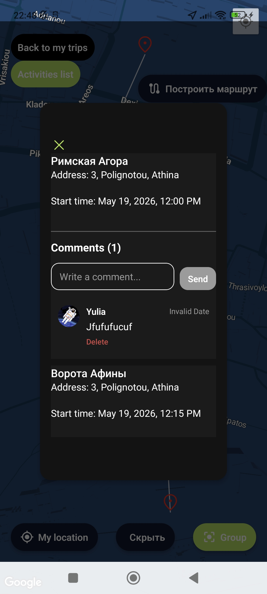<br/>
      <sub>Activities (dark)</sub>
    </td>
  </tr>
</table>

## Setup & Installation

1. Clone

```bash
git clone https://github.com/yourusername/traveltracker.git
cd traveltracker
npm install
```

2. Install dependencies:

```bash
yarn install
```

3. Enviroment setup

```bash
cp .env.example .env.local # Fill in Supabase URL/Anon Key, API secrets, and map keys
```

4. DB setup

- Run SQL migrations in Supabase SQL Editor (tables, indexes, RLS policies, RPC functions)
- Enable Realtime for activities, trip_members, activity_comments, expenses

```bash
yarn db:start # Local DB start
```

5. Generate api:

```bash
yarn openapi
```

6. Prebuild native-projects:

```bash
yarn prebuild
```

7. Local build for Android:

```bash
yarn android
```

8. Local build for IOS:

```bash
yarn ios
```

## Author

**Yulia Vorotintseva**

- **GitHub**: @YuliaVorotintseva
- **Email**: yulia.vorotintseva@gmail.com
